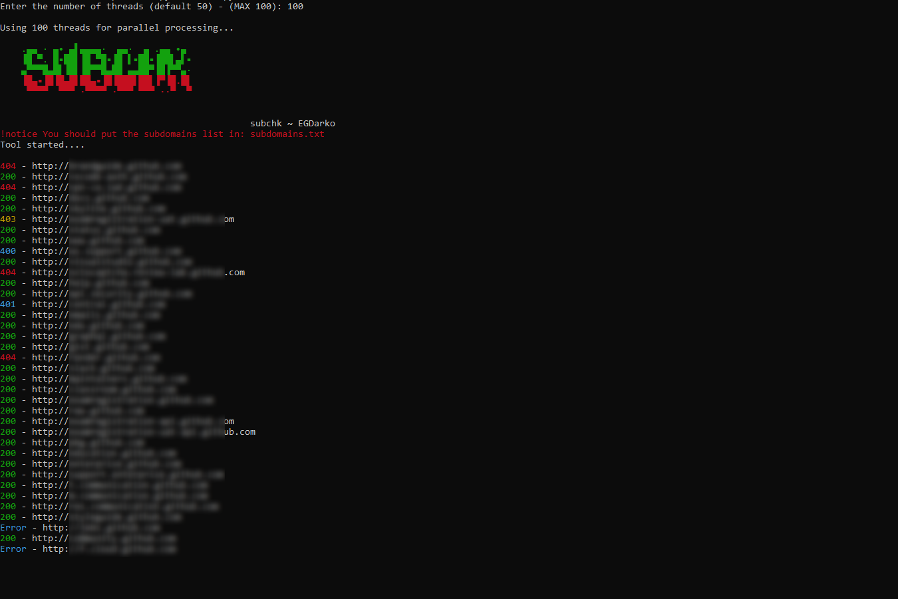

# 🌐 subchk - Subdomain Status Checker

`subchk` is a **multi-threaded subdomain status checker** that allows users to quickly check the HTTP response status of subdomains from a list. It supports **multi-threading** for faster scanning and saves the results in an output file.




## 🚀 Features
- **Multi-threaded processing** to improve speed.
- **Color-coded status output** using `colorama` for better readability.
- **Automatic URL formatting** (adds `http://` if missing).
- **Results saved to `output_results.txt`**.

## 📦 Installation

### 1️⃣ Clone the Repository
```bash
git clone https://github.com/EGDarko/subchk.git
```
``` bash
cd subchk
```
### 2️⃣ Install Dependencies
Install the required dependencies using:
```bash
pip install -r requirements.txt
```
if not working try:
```bash
sudo apt install python3-requests && sudo apt install python3-colorama
```
## 🎯 Usage

### 🔹 **Step 1: Prepare a Subdomains List**
Create or edit `subdomains.txt` and add the subdomains you want to check.

Example (`subdomains.txt`):
```
example.sub.com
ex2.sample.com
```

### 🔹 **Step 2: Run the Script**
Run the script and specify the number of threads:
```bash
python3 main.py
```
It will prompt you to enter the **number of threads** for concurrent execution.

### 🔹 **Step 3: Check the Output**
- The script will **display the status of each subdomain** in the terminal.
- **Results are saved** in `output_results.txt`.
- To filter the output you can use tools like ```grep```
Example:
```bash
cat output_results.txt | grep -E '^200' >> (any name).txt
```
Example Output:
```
200 - http://example.sub.com
404 - http://ex2.sample.com

Scan Finished. Results saved to 'output_results.txt'
```

## 🐟 Status Code Meaning
- 🟢 **200** - Subdomain is **reachable** (success).
- 🔴 **404** - Subdomain **not found**.
- 🟡 **403** - Subdomain is **forbidden**.
- 🔵 **Other codes** - Various HTTP responses.

## ⚠️ Important Notes
- Ensure you have **`subdomains.txt`** in the same directory.
- If a subdomain doesn't have `http://` or `https://`, the script **automatically adds `http://`**.
- Recommended **100 Threads** for accurate result.

## 📄 License

[](https://opensource.org/licenses/MIT)

This project is licensed under the [MIT License](https://opensource.org/licenses/MIT).


---

🎯 **Developed by:** *EGDarko* 🚀

